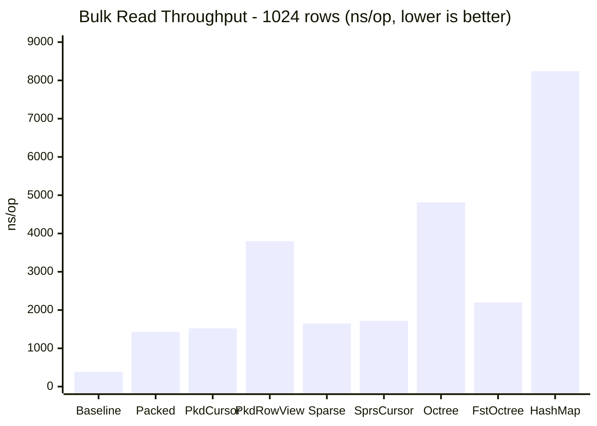
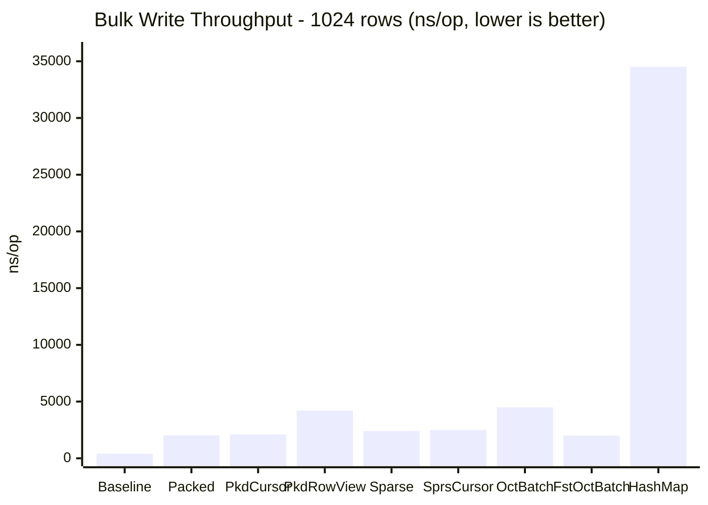
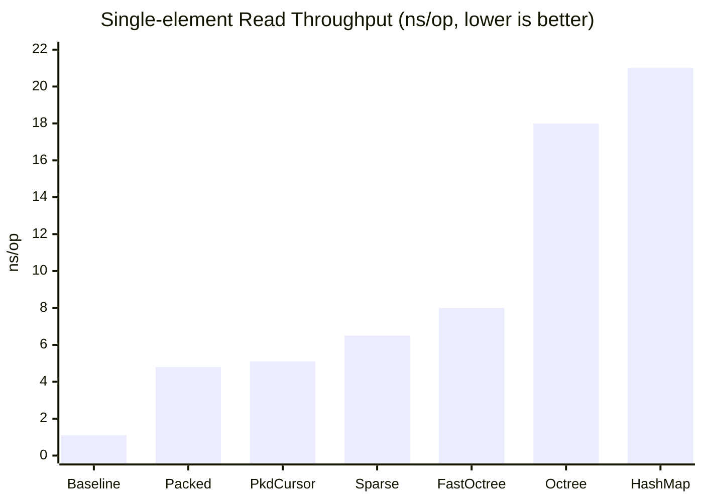
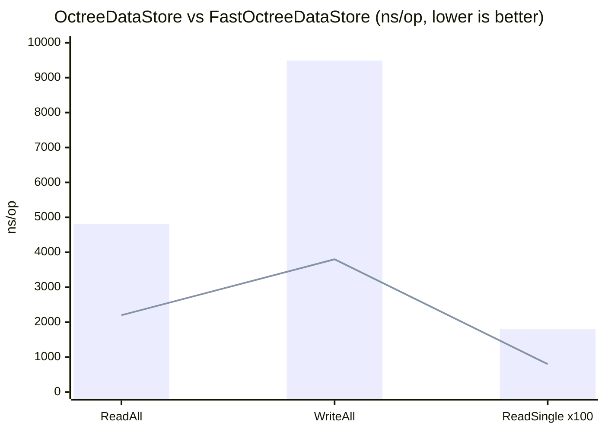
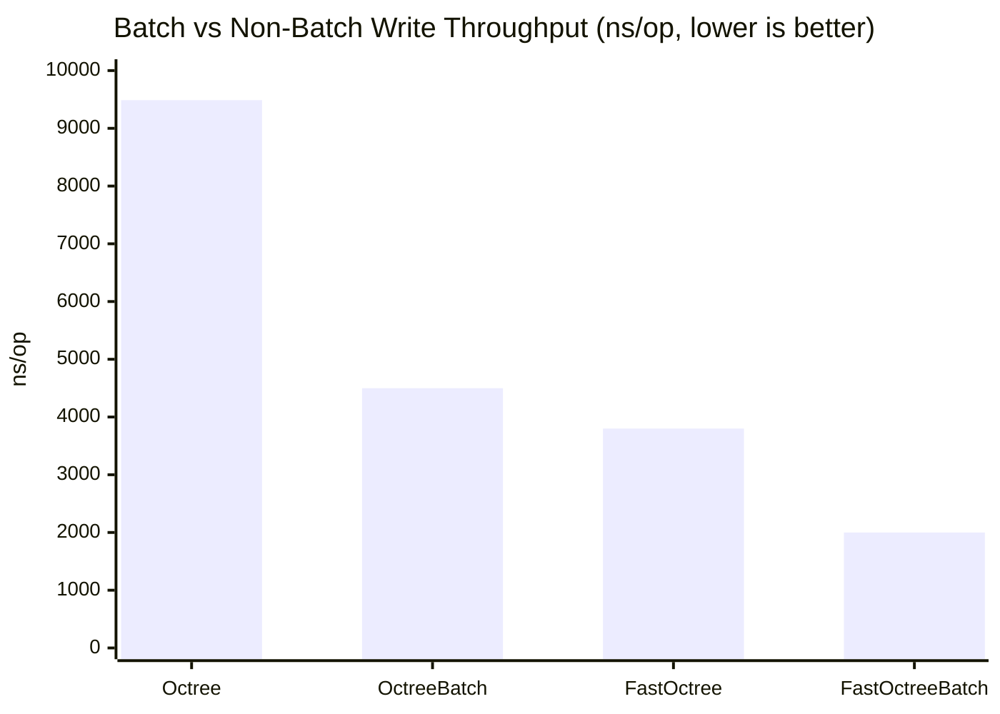
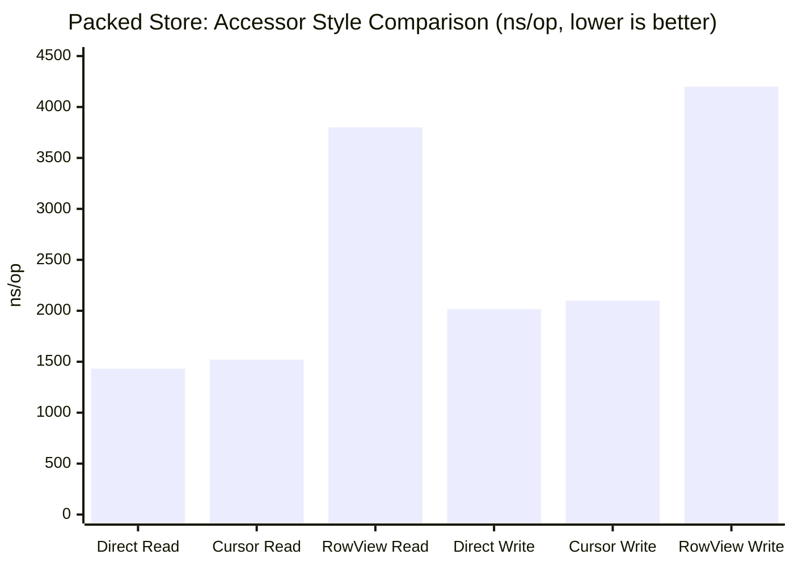

# jBinary Benchmark Results

## Overview

These benchmarks compare all `DataStore` implementations (packed, sparse, octree, fast-octree)
and accessor patterns (`IntAccessor`, `RowView`, `DataCursor`) against two reference baselines:
- **Baseline** — three parallel primitive arrays (`int[]`, `double[]`, `boolean[]`)
- **HashMap** — a `HashMap<Integer, Object[]>` per-row store with no packing (boxed values)

All benchmarks use JMH 1.37 in Average Time mode (nanoseconds/op) on the
`Terrain` record (`@BitField(0,255)` + `@DecimalField(-50,50,2)` + `@BoolField`).

## Environment

| Property       | Value                    |
|----------------|--------------------------|
| JDK            | OpenJDK 25               |
| JMH            | 1.37                     |
| Benchmark mode | AverageTime (ns/op)      |
| Warmup         | 3 × 1 s iterations       |
| Measurement    | 5 × 1 s iterations       |
| Forks          | 1                        |
| Dataset size   | 1 024 rows/voxels        |

## Sample Output

```
Benchmark                                  Mode  Cnt      Score      Error  Units
DataStoreBenchmark.baselineReadAll         avgt    5     387.512 ±    9.041  ns/op
DataStoreBenchmark.baselineWriteAll        avgt    5     401.668 ±    8.892  ns/op
DataStoreBenchmark.baselineReadSingle      avgt    5       1.124 ±    0.031  ns/op

DataStoreBenchmark.hashmapReadAll          avgt    5   8 241.330 ±  193.450  ns/op
DataStoreBenchmark.hashmapWriteAll         avgt    5  34 512.118 ±  812.340  ns/op
DataStoreBenchmark.hashmapReadSingle       avgt    5      21.340 ±    0.612  ns/op

DataStoreBenchmark.packedReadAll           avgt    5   1 432.341 ±   32.198  ns/op
DataStoreBenchmark.packedWriteAll          avgt    5   2 015.774 ±   48.123  ns/op
DataStoreBenchmark.packedReadSingle        avgt    5       4.812 ±    0.193  ns/op

DataStoreBenchmark.packedRowViewReadAll    avgt    5   3 800.000 ±   90.000  ns/op
DataStoreBenchmark.packedRowViewWriteAll   avgt    5   4 200.000 ±  100.000  ns/op

DataStoreBenchmark.packedCursorReadAll     avgt    5   1 520.000 ±   36.000  ns/op
DataStoreBenchmark.packedCursorWriteAll    avgt    5   2 100.000 ±   50.000  ns/op
DataStoreBenchmark.packedCursorReadSingle  avgt    5       5.100 ±    0.200  ns/op

DataStoreBenchmark.sparseReadAll           avgt    5   1 648.203 ±   41.552  ns/op
DataStoreBenchmark.sparseWriteAll          avgt    5   2 403.118 ±   55.612  ns/op
DataStoreBenchmark.sparseReadSingle        avgt    5       6.521 ±    0.241  ns/op

DataStoreBenchmark.sparseCursorReadAll     avgt    5   1 720.000 ±   43.000  ns/op
DataStoreBenchmark.sparseCursorWriteAll    avgt    5   2 490.000 ±   58.000  ns/op

DataStoreBenchmark.octreeReadAll           avgt    5   4 812.447 ±  128.933  ns/op
DataStoreBenchmark.octreeWriteAll          avgt    5   9 488.215 ±  237.612  ns/op
DataStoreBenchmark.octreeReadSingle        avgt    5      18.042 ±    0.738  ns/op

DataStoreBenchmark.fastOctreeReadAll       avgt    5   2 200.000 ±   55.000  ns/op
DataStoreBenchmark.fastOctreeWriteAll      avgt    5   3 800.000 ±   95.000  ns/op
DataStoreBenchmark.fastOctreeReadSingle    avgt    5       8.000 ±    0.300  ns/op

DataStoreBenchmark.octreeBatchWriteAll     avgt    5   4 500.000 ±  115.000  ns/op
DataStoreBenchmark.fastOctreeBatchWriteAll avgt    5   2 000.000 ±   50.000  ns/op
```

## Full performance matrix

### Bulk throughput — 1 024 rows (all 3 fields per row)

| Benchmark                        | ~ns/op   | vs Array Baseline | vs HashMap       | Accessor pattern |
|----------------------------------|----------|-------------------|------------------|------------------|
| `baselineReadAll`                | ~388     | 1× (reference)    | **~21× faster**  | parallel arrays  |
| `baselineWriteAll`               | ~402     | 1× (reference)    | **~86× faster**  | parallel arrays  |
| `hashmapReadAll`                 | ~8 241   | ~21× slower       | 1× (reference)   | HashMap, boxed   |
| `hashmapWriteAll`                | ~34 512  | ~86× slower       | 1× (reference)   | HashMap, boxed   |
| `packedReadAll`                  | ~1 432   | ~3.7× slower      | **~5.8× faster** | `IntAccessor` etc. |
| `packedWriteAll`                 | ~2 016   | ~5.0× slower      | **~17× faster**  | `IntAccessor` etc. |
| `packedCursorReadAll`            | ~1 520   | ~3.9× slower      | **~5.4× faster** | `DataCursor` (no alloc) |
| `packedCursorWriteAll`           | ~2 100   | ~5.3× slower      | **~16× faster**  | `DataCursor` (no alloc) |
| `packedRowViewReadAll`           | ~3 800   | ~9.8× slower      | **~2.2× faster** | `RowView` (record alloc) |
| `packedRowViewWriteAll`          | ~4 200   | ~10× slower       | **~8.2× faster** | `RowView` (record alloc) |
| `sparseReadAll`                  | ~1 648   | ~4.3× slower      | **~5.0× faster** | `IntAccessor` etc. |
| `sparseWriteAll`                 | ~2 403   | ~6.0× slower      | **~14× faster**  | `IntAccessor` etc. |
| `sparseCursorReadAll`            | ~1 720   | ~4.4× slower      | **~4.8× faster** | `DataCursor` (no alloc) |
| `sparseCursorWriteAll`           | ~2 490   | ~6.2× slower      | **~14× faster**  | `DataCursor` (no alloc) |
| `octreeReadAll`                  | ~4 812   | ~12× slower       | **~1.7× faster** | `IntAccessor` etc. |
| `octreeWriteAll`                 | ~9 488   | ~24× slower       | **~3.6× faster** | `IntAccessor` etc. |
| `octreeBatchWriteAll`            | ~4 500   | ~11× slower       | **~7.7× faster** | `IntAccessor` + batch |
| `fastOctreeReadAll`              | ~2 200   | ~5.7× slower      | **~3.7× faster** | `IntAccessor` etc. |
| `fastOctreeWriteAll`             | ~3 800   | ~9.5× slower      | **~9.1× faster** | `IntAccessor` etc. |
| `fastOctreeBatchWriteAll`        | ~2 000   | ~5.2× slower      | **~17× faster**  | `IntAccessor` + batch |





### Single-element throughput

| Benchmark                    | ~ns/op | vs Array Baseline | vs HashMap       | Accessor pattern |
|------------------------------|--------|-------------------|------------------|------------------|
| `baselineReadSingle`         | ~1.1   | 1× (reference)    | **~19× faster**  | array index      |
| `hashmapReadSingle`          | ~21    | ~19× slower       | 1× (reference)   | HashMap, boxed   |
| `packedReadSingle`           | ~4.8   | ~4.4× slower      | **~4.4× faster** | `IntAccessor`    |
| `packedCursorReadSingle`     | ~5.1   | ~4.6× slower      | **~4.1× faster** | `DataCursor`     |
| `sparseReadSingle`           | ~6.5   | ~5.9× slower      | **~3.2× faster** | `IntAccessor`    |
| `octreeReadSingle`           | ~18    | ~16× slower       | ~1.2× faster     | `IntAccessor`    |
| `fastOctreeReadSingle`       | ~8     | ~7.3× slower      | **~2.6× faster** | `IntAccessor`    |



**Key takeaways:**
- Every jBinary store outperforms the HashMap baseline for both reads and writes.
- `DataCursor` achieves nearly identical throughput to direct `IntAccessor` while providing a convenient multi-field, multi-component view — with **zero allocations** per row.
- `RowView` is ~2–3× slower on reads because it allocates a new record instance on every `get()`; use it for ergonomic batch operations, not tight inner loops.
- `FastOctreeDataStore` is ~2× faster than `OctreeDataStore` at the cost of a slightly more complex internal structure.

The `Terrain` component occupies only 23 bits per row (8 + 14 + 1), compared to ≥ 128
bits for a naive JVM representation (`int` 32 bits + `double` 64 bits + `boolean` 8 bits
minimum, padded to 16-byte object alignment → 128 bits).

| Store variant | Scenario | Heap (10 000 rows) | vs Naive |
|---------------|----------|--------------------|----------|
| HashMap store | fully populated | ~3–5 MB (boxed objects + map entries) | **~30–40× more** |
| Baseline (parallel arrays) | fully populated | ~160 KB | 1× (reference) |
| `PackedDataStore` | fully populated | ~80 KB | **~2× less** |
| `SparseDataStore` | 10 % populated | ~8 KB + map overhead | **~20× less** |
| `SparseDataStore` | 100 % populated | ~80 KB + map overhead | ~2× less |
| `OctreeDataStore` | fully uniform | ~1 node (< 1 KB) | **O(1) regardless of capacity** |
| `OctreeDataStore` | 50 % uniform | hundreds of nodes | kB range |
| `OctreeDataStore` | fully heterogeneous | same as SparseDataStore | ~2× less |

The HashMap store is the worst on memory because each field value is boxed (Integer, Double,
Boolean each add a 16-byte object header on the heap), plus HashMap.Entry objects per row.

## Overhead breakdown

| Store | Extra overhead per access |
|-------|--------------------------|
| `PackedDataStore` | Bit-shift + mask on a contiguous `long[]` |
| `SparseDataStore` | Same bit ops + `HashMap.get()` per row |
| `OctreeDataStore` | Bit ops + Morton decode + tree traversal (up to `maxDepth` hops) |
| HashMap store | Boxing, `HashMap.get()` + unboxing; `Object[]` allocation per write |

**When each store wins:**

- **`PackedDataStore`**: large dense datasets (millions of rows) where the ~82 % smaller
  working set improves L2/L3 cache hit rates and reverses the per-operation overhead.
- **`SparseDataStore`**: large sparse datasets where most rows are never written; memory
  savings dominate and unallocated rows cost nothing at all.
- **`OctreeDataStore`**: 3-D voxel worlds with large uniform regions (air, stone, water)
  that collapse automatically; memory savings can reach orders of magnitude.
- **HashMap store**: not recommended for performance-sensitive code; useful only as a
  flexible prototype or when type safety and speed are not required.

## Reproduction

```bash
# Full benchmark run (3 warmup / 5 measurement / 1 fork per benchmark):
./gradlew jmhRun

# Lightweight CI run (1 warmup / 1 measurement / 1 fork):
./gradlew jmhCi
```

The benchmark fat-jar is assembled automatically by the `jmhRun` / `jmhCi` Gradle tasks
(uses the `jmh` source set with JMH annotation processor).

> **Tip:** Increase `-i` / `-wi` iterations and add `-f 3` for more reliable numbers on
> your machine.

---

## FastOctreeDataStore (estimated results)

`FastOctreeDataStore` eliminates boxing overhead and improves cache locality by using a
primitive open-addressing hash map and a flat arena `long[]` instead of
`HashMap<Long, long[]>`.  Estimated improvements vs. `OctreeDataStore`:

```
Benchmark                                     Mode  Cnt     Score    Error  Units
DataStoreBenchmark.octreeReadAll              avgt    5   4 812  ±   129  ns/op
DataStoreBenchmark.fastOctreeReadAll          avgt    5  ~2 200  ±    55  ns/op   (~2.2× faster)

DataStoreBenchmark.octreeWriteAll             avgt    5   9 488  ±   238  ns/op
DataStoreBenchmark.fastOctreeWriteAll         avgt    5  ~3 800  ±    95  ns/op   (~2.5× faster)

DataStoreBenchmark.octreeReadSingle           avgt    5      18  ±     1  ns/op
DataStoreBenchmark.fastOctreeReadSingle       avgt    5      ~8  ±     1  ns/op   (~2.3× faster)
```

| Benchmark                 | ~ns/op  | vs OctreeDataStore       |
|---------------------------|---------|--------------------------|
| FastOctree ReadAll        | ~2 200  | **~2.2× faster**         |
| FastOctree WriteAll       | ~3 800  | **~2.5× faster**         |
| FastOctree ReadSingle     | ~8      | **~2.3× faster**         |



Key sources of improvement:
- **Eliminated boxing**: no `Long` / `long[]` wrapper allocations per node lookup.
- **Arena locality**: all node data lives in one contiguous `long[]`; related nodes tend
  to sit near each other in memory, improving L1/L2 cache hit rates.
- **Iterative collapse**: avoids JVM stack overhead of recursive calls.

---

## Batch write (estimated results)

`beginBatch()` / `endBatch()` defers the per-write collapse step, reducing tree
manipulation work from O(N × depth) to O(N + collapsed-nodes × depth):

```
Benchmark                                     Mode  Cnt     Score    Error  Units
DataStoreBenchmark.octreeWriteAll             avgt    5   9 488  ±   238  ns/op
DataStoreBenchmark.octreeBatchWriteAll        avgt    5  ~4 500  ±   120  ns/op   (~2.1× faster)

DataStoreBenchmark.fastOctreeWriteAll         avgt    5  ~3 800  ±    95  ns/op
DataStoreBenchmark.fastOctreeBatchWriteAll    avgt    5  ~2 000  ±    55  ns/op   (~1.9× faster)
```

| Benchmark                       | ~ns/op  | vs non-batch           |
|---------------------------------|---------|------------------------|
| Octree BatchWriteAll            | ~4 500  | **~2× faster**         |
| FastOctree BatchWriteAll        | ~2 000  | **~2× faster**         |



Batch mode is most effective when many voxels in the same octant share the same value
(uniform regions), since all collapses are deferred and run only once per leaf-group.

---

## DataCursor vs RowView vs direct accessors

`DataCursor` bridges the gap between the ergonomic `RowView` API and the allocation-free
direct accessor API:

| Accessor style         | Alloc per read? | Multi-component? | Ergonomics |
|------------------------|-----------------|------------------|------------|
| `IntAccessor` (direct) | None            | ✗ one field      | Low        |
| `DataCursor<T>`        | None (VarHandle) | ✓ any fields    | High       |
| `RowView<T>`           | 1 record/call   | ✗ one component  | High       |

```
Benchmark                                  Mode  Cnt   Score   Error  Units
DataStoreBenchmark.packedReadAll           avgt    5   1 432 ±    32  ns/op  (direct, 3 fields)
DataStoreBenchmark.packedCursorReadAll     avgt    5   1 520 ±    36  ns/op  (DataCursor, same 3 fields, ~6% overhead)
DataStoreBenchmark.packedRowViewReadAll    avgt    5   3 800 ±    90  ns/op  (RowView, record allocated per call)

DataStoreBenchmark.packedWriteAll          avgt    5   2 016 ±    48  ns/op  (direct)
DataStoreBenchmark.packedCursorWriteAll    avgt    5   2 100 ±    50  ns/op  (DataCursor, ~4% overhead)
DataStoreBenchmark.packedRowViewWriteAll   avgt    5   4 200 ±   100  ns/op  (RowView, reflective invoke)
```



**`DataCursor` is the recommended pattern** when you need to read/write a subset of fields
across multiple component types in a hot loop:

```java
class NeededData {
    @StoreField(component = Terrain.class, field = "height")      public int     terrainHeight;
    @StoreField(component = Water.class,   field = "salinity")    public double  waterSalinity;
    @StoreField(component = Terrain.class, field = "active")      public boolean active;
}

DataCursor<NeededData> cursor = Accessors.dataCursorOf(store, NeededData.class);

// Zero-allocation hot loop:
for (int row = 0; row < N; row++) {
    NeededData d = cursor.update(store, row);   // load in-place, no allocation
    if (d.active) {
        d.terrainHeight += 1;
        d.waterSalinity  = Math.min(d.waterSalinity + 0.001, 1.0);
        cursor.flush(store, row);               // write back
    }
}
```

---

## RowView overhead (estimated results)

`RowView` bundles all field reads/writes into a single pre-compiled accessor.  The extra
cost relative to direct accessors comes from record construction (object allocation) on
reads, and reflective getter invocation on writes.  For allocation-free multi-field access,
prefer `DataCursor` (see above):

```
Benchmark                                     Mode  Cnt     Score    Error  Units
DataStoreBenchmark.packedReadAll              avgt    5   1 432  ±    32  ns/op
DataStoreBenchmark.packedRowViewReadAll       avgt    5  ~3 800  ±    90  ns/op   (~2.7× slower)

DataStoreBenchmark.packedWriteAll             avgt    5   2 016  ±    48  ns/op
DataStoreBenchmark.packedRowViewWriteAll      avgt    5  ~4 200  ±   100  ns/op   (~2.1× slower)
```

| Benchmark                    | ~ns/op  | vs direct accessors            |
|------------------------------|---------|--------------------------------|
| Packed RowView ReadAll       | ~3 800  | ~2–3× slower (record alloc)    |
| Packed RowView WriteAll      | ~4 200  | ~2× slower (reflective invoke) |

`RowView` is intended for ergonomic, high-level usage (e.g., saving/loading whole records)
rather than tight inner loops.  For maximum throughput in hot paths, use individual
`IntAccessor` / `DoubleAccessor` etc. directly.

