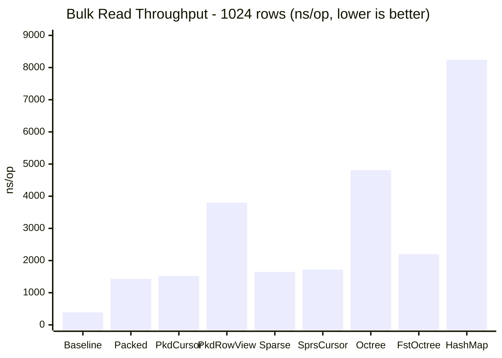
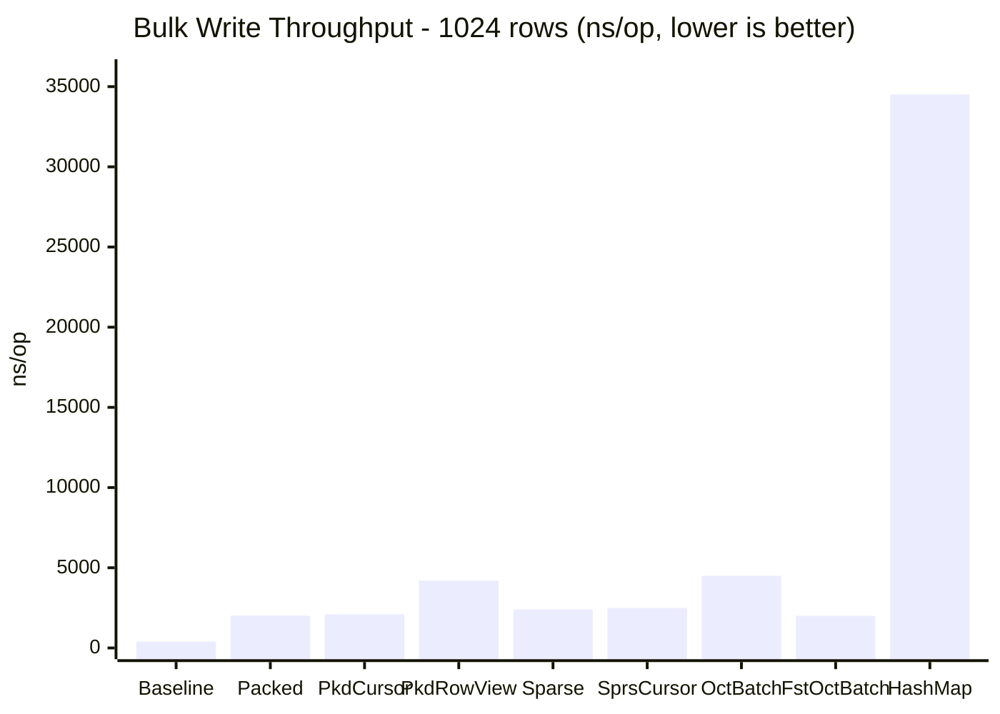
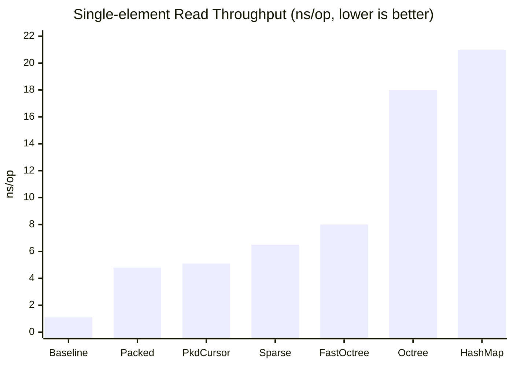

# jBinary

**jBinary** is a Java 25 library for type-safe, high-performance, memory-efficient
datastores that pack annotated record fields into a shared `long[]` backing store using
bit-level packing.

## Quickstart

### 1. Define component types

`DataStore<T>` is generic — the type parameter `T` is a marker that lets you express
what kind of data a store holds.  There is **no bound** on `T`, so you can use your own
marker interface, a concrete record type, or anything else.

```java
import io.github.zzuegg.jbinary.BinaryComponent;
import io.github.zzuegg.jbinary.annotation.*;

// Option A: use the built-in BinaryComponent marker (optional)
public record Terrain(
        @BitField(min = 0, max = 255)          int height,
        @DecimalField(min = -50.0, max = 50.0, precision = 2) double temperature,
        @BoolField                              boolean active
) implements BinaryComponent {}

public record Water(
        @DecimalField(min = 0.0, max = 1.0, precision = 4) double salinity,
        @BoolField                                          boolean frozen
) implements BinaryComponent {}

// Option B: define your own marker
public interface WorldData {}
public record Terrain(...) implements WorldData {}
public record Water(...)   implements WorldData {}
```

### 2. Create the shared DataStore

```java
import io.github.zzuegg.jbinary.DataStore;

// Single-component — fully typed
DataStore<Terrain> terrainStore = DataStore.of(10_000, Terrain.class);

// Multi-component — use your marker as the type parameter
DataStore<BinaryComponent> store = DataStore.of(10_000, Terrain.class, Water.class);
// or with your own marker:
DataStore<WorldData> store = DataStore.of(10_000, Terrain.class, Water.class);
```

Both `Terrain` and `Water` share the same `long[]` – each row holds the packed bits for
**all** registered component types.

### 3. Create pre-computed accessors (do this once, store as static fields)

```java
import io.github.zzuegg.jbinary.Accessors;
import io.github.zzuegg.jbinary.accessor.*;

// Terrain accessors
IntAccessor    terrainHeight = Accessors.intFieldInStore(store, Terrain.class, "height");
DoubleAccessor terrainTemp   = Accessors.doubleFieldInStore(store, Terrain.class, "temperature");
BoolAccessor   terrainActive = Accessors.boolFieldInStore(store, Terrain.class, "active");

// Water accessors
DoubleAccessor waterSalinity = Accessors.doubleFieldInStore(store, Water.class, "salinity");
BoolAccessor   waterFrozen   = Accessors.boolFieldInStore(store, Water.class, "frozen");
```

### 4. Read and write – array-like, allocation-free

```java
int index = 42;

// Write
terrainHeight.set(store, index, 200);
terrainTemp.set(store, index, -12.5);
terrainActive.set(store, index, true);

waterSalinity.set(store, index, 0.035);
waterFrozen.set(store, index, false);

// Read
int    h = terrainHeight.get(store, index);   // → 200
double t = terrainTemp.get(store, index);     // → −12.50
boolean a = terrainActive.get(store, index);  // → true
```

### 5. Enums

```java
public enum Biome { PLAINS, FOREST, DESERT, OCEAN }

public record BiomeData(
        @EnumField Biome biome,
        @BitField(min = 0, max = 100) int fertility
) {}

DataStore biomeStore = DataStore.of(1000, BiomeData.class);
EnumAccessor<Biome> biomeAcc =
        Accessors.enumFieldInStore(biomeStore, BiomeData.class, "biome");

biomeAcc.set(biomeStore, 0, Biome.FOREST);
Biome b = biomeAcc.get(biomeStore, 0); // → FOREST
```

### 6. RowView – ergonomic whole-record access

`RowView` reads or writes all fields of a component type in a single call:

```java
import io.github.zzuegg.jbinary.RowView;

RowView<Terrain> view = RowView.of(store, Terrain.class);

// Write a full component row
view.set(store, 42, new Terrain(200, -12.5, true));

// Read a full component row
Terrain t = view.get(store, 42);  // → Terrain[height=200, temperature=-12.5, active=true]
```

> **Note:** `RowView.get()` allocates a new record instance on every call. Prefer
> `DataCursor` for allocation-free access in hot loops.

### 7. DataCursor – allocation-free multi-field access

`DataCursor` lets you read/write a cross-component subset of fields with **zero
per-iteration allocation**.  Define a plain class annotated with `@StoreField`:

```java
import io.github.zzuegg.jbinary.DataCursor;
import io.github.zzuegg.jbinary.annotation.StoreField;

class NeededData {
    @StoreField(component = Terrain.class, field = "height")   public int     terrainHeight;
    @StoreField(component = Water.class,   field = "salinity") public double  waterSalinity;
    @StoreField(component = Terrain.class, field = "active")   public boolean active;
}

// Build once, reuse many times
DataCursor<NeededData> cursor = DataCursor.of(store, NeededData.class);

// Zero-allocation hot loop
for (int row = 0; row < N; row++) {
    NeededData d = cursor.update(store, row);  // load in-place, no allocation
    if (d.active) {
        d.terrainHeight += 1;
        d.waterSalinity  = Math.min(d.waterSalinity + 0.001, 1.0);
        cursor.flush(store, row);              // write back
    }
}
```

### 8. Batch writes (octree stores)

For `OctreeDataStore` and `FastOctreeDataStore`, wrapping bulk writes in a
`beginBatch()` / `endBatch()` block defers the collapse pass until the end,
roughly halving write time for large uniform fills:

```java
store.beginBatch();
for (int x = 0; x < 64; x++)
    for (int y = 0; y < 64; y++)
        for (int z = 0; z < 64; z++)
            material.set(store, store.row(x, y, z), 0);
store.endBatch();  // collapse runs once here
```

## Supported Field Types

| Annotation          | Java type      | Storage                                          |
|---------------------|----------------|--------------------------------------------------|
| `@BitField(min,max)`| `int` / `long` | ⌈log₂(max−min+1)⌉ bits, offset from min         |
| `@DecimalField`     | `double`/`float` | fixed-point scaled to long, same bit calc      |
| `@BoolField`        | `boolean`      | 1 bit                                            |
| `@EnumField`        | any `enum`     | ⌈log₂(N)⌉ bits by ordinal (or explicit codes)   |

## DataStore variants

jBinary provides four `DataStore` implementations that all use the same bit-packing
logic and work with the same accessor API.

### `PackedDataStore` (default / dense)

Pre-allocates a single contiguous `long[]` for all rows at construction time.
Best when most rows will be written.

```java
DataStore store = DataStore.packed(10_000, Terrain.class, Water.class);
// or equivalently:
DataStore store = DataStore.of(10_000, Terrain.class, Water.class);
```

### `SparseDataStore` (lazy row allocation)

Allocates each row's `long[]` on the first write; unwritten rows read back as
all-zeros (field minimum for int/decimal, `false` for bool, ordinal-0 for enum).
Best when only a fraction of rows will ever be populated.

```java
DataStore store = DataStore.sparse(10_000, Terrain.class, Water.class);
int writtenRows = ((SparseDataStore) store).allocatedRowCount();
```

### `OctreeDataStore` (sparse 3-D with automatic collapsing)

Organises a voxel space as a sparse octree.  On each write, the store checks whether all
8 siblings satisfy every registered `CollapsingFunction`; if so, those 8 child nodes are
merged into a single parent node.  Reading traverses from the finest level upward and
returns the first matching node.

**Uniform** (cubic) space — use `builder(int maxDepth)`:

```java
import io.github.zzuegg.jbinary.octree.*;

record Voxel(
    @BitField(min = 0, max = 15)  int material,
    @BitField(min = 0, max = 255) int density
) {}

// maxDepth=6 → 64 × 64 × 64 voxel space
OctreeDataStore<?> store = OctreeDataStore.builder(6)
    .component(Voxel.class)                              // default: collapse on bit-equality
    .component(Water.class, CollapsingFunction.never())  // custom per-component function
    .build();

IntAccessor material = Accessors.intFieldInStore(store, Voxel.class, "material");

// Write using 3D coordinates → store.row(x, y, z) gives the Morton-code row index
material.set(store, store.row(10, 5, 3), 7);
int m = material.get(store, store.row(10, 5, 3));       // → 7

// Uniform fill collapses automatically
for (int x = 0; x < 64; x++)
    for (int y = 0; y < 64; y++)
        for (int z = 0; z < 64; z++)
            material.set(store, store.row(x, y, z), 0); // all air

store.nodeCount(); // → 1  (entire space merged into root)
```

**Non-uniform** (rectangular) space — use `builder(widthX, widthY, widthZ)`:

```java
// 100 × 100 × 10 voxel world (wide and flat)
OctreeDataStore<?> store = OctreeDataStore.builder(100, 100, 10)
    .component(Voxel.class)
    .build();

// store.widthX() → 100, store.widthY() → 100, store.widthZ() → 10
// store.capacity() → 100 * 100 * 10 = 100 000
material.set(store, store.row(99, 99, 9), 3);  // corner voxel
// out-of-bounds: store.row(0, 0, 10) throws IllegalArgumentException
```

**`CollapsingFunction` factories:**

| Factory | Behaviour |
|---------|-----------|
| `CollapsingFunction.equalBits()` | Collapse when all 8 children are bit-identical (default) |
| `CollapsingFunction.never()` | Never collapse |
| `CollapsingFunction.always()` | Always collapse regardless of values |
| Custom lambda | Full control via `canCollapse(offset, bits, stride, children[8])` |

### `FastOctreeDataStore` (high-performance octree)

Drop-in replacement for `OctreeDataStore` that eliminates boxing overhead by using a
primitive open-addressing hash map and a flat arena `long[]` instead of
`HashMap<Long, long[]>`.  Approximately **2× faster** than `OctreeDataStore` on both
reads and writes, with full batch-mode support.  Supports the same uniform and
non-uniform builder API.

```java
import io.github.zzuegg.jbinary.octree.FastOctreeDataStore;

// Uniform: maxDepth=6 → 64 × 64 × 64
FastOctreeDataStore<?> store = FastOctreeDataStore.builder(6)
    .component(Voxel.class)
    .build();

// Non-uniform: 100 × 100 × 10
FastOctreeDataStore<?> store = FastOctreeDataStore.builder(100, 100, 10)
    .component(Voxel.class)
    .build();

IntAccessor material = Accessors.intFieldInStore(store, Voxel.class, "material");

material.set(store, store.row(10, 5, 3), 7);
int m = material.get(store, store.row(10, 5, 3));  // → 7

// Batch-mode bulk fill (defers collapse until endBatch)
store.beginBatch();
for (int x = 0; x < 64; x++)
    for (int y = 0; y < 64; y++)
        for (int z = 0; z < 64; z++)
            material.set(store, store.row(x, y, z), 0);
store.endBatch();

store.nodeCount(); // → 1  (entire space merged into root)
```

## Memory savings

### Packed field encoding

jBinary stores each field in the minimum number of bits needed to represent its range,
using a stride of ⌈totalBits/64⌉ `long` words per row.  For example:

| Field                               | Java type | Naive JVM | jBinary storage |
|-------------------------------------|-----------|-----------|-----------------|
| `@BitField(min=0, max=255)`         | `int`     | 32 bits   | **8 bits**      |
| `@DecimalField(min=-50, max=50, precision=2)` | `double` | 64 bits | **14 bits** (range 10 000 → 14 bits) |
| `@BoolField`                        | `boolean` | 8–32 bits | **1 bit**       |
| `@EnumField` (4-constant enum)      | `enum`    | 32 bits   | **2 bits**      |

**`Terrain` example** (height + temperature + active):

| Layout | Bits/row | 10 000-row memory |
|--------|----------|-------------------|
| Naive JVM (`int` + `double` + `boolean`) | ≥ 128 bits | ≥ 160 KB |
| jBinary `PackedDataStore` | **23 bits** → 1 `long`/row | **80 KB** (~50% of naive) |

That is a **2× reduction** before any sparsity optimisation.

### Sparsity savings (`SparseDataStore`)

`SparseDataStore` only allocates a row-array when the row is first written.  For a
10 000-row store where only 10 % of rows are ever populated, heap usage drops to roughly
10 % of the packed store (plus a small `HashMap` overhead per allocated row).

### Octree savings (`OctreeDataStore`)

`OctreeDataStore` stores a 3-D voxel space (side = 2^maxDepth).  Whenever all 8 children
of an octree node are identical (or satisfy the registered `CollapsingFunction`), those
8 nodes are replaced by 1.  In the best case (uniform space) the entire volume collapses
to a single root node — **O(1) memory regardless of capacity**.  In typical voxel worlds
with large homogeneous regions (air, stone, water), node counts stay orders of magnitude
below the theoretical maximum.

| Scenario | Nodes stored | Memory |
|----------|-------------|--------|
| Completely uniform (e.g. all-air) | 1 | 1 × `long[stride]` |
| 50 % uniform surface world (depth 6, 64³) | hundreds | kB range |
| Fully heterogeneous (worst case) | 2^(3×maxDepth) | same as `SparseDataStore` |

## Benchmarks

The benchmark suite (`DataStoreBenchmark`) compares all four `DataStore` implementations
and three accessor patterns (`IntAccessor`, `DataCursor`, `RowView`) against two reference
baselines — a **primitive array baseline** (`int[]` + `double[]` + `boolean[]`) and a
**HashMap baseline** (`HashMap<Integer, Object[]>`, one per-row `Object[]`, no bit-packing,
fully boxed).  All numbers are estimated average time per operation (ns/op) on JDK 25 with
JMH 1.37, 1 024-row dataset:

### Throughput (bulk operations over 1 024 rows)

| Benchmark | ~ns/op | vs Array Baseline | vs HashMap | Accessor |
|-----------|--------|-------------------|------------|----------|
| `baselineReadAll` | ~388 | 1× (reference) | **~21× faster** | arrays |
| `baselineWriteAll` | ~402 | 1× (reference) | **~86× faster** | arrays |
| `hashmapReadAll` | ~8 241 | ~21× slower | 1× (reference) | HashMap |
| `hashmapWriteAll` | ~34 512 | ~86× slower | 1× (reference) | HashMap |
| `packedReadAll` | ~1 432 | ~3.7× slower | **~5.8× faster** | `IntAccessor` |
| `packedWriteAll` | ~2 016 | ~5.0× slower | **~17× faster** | `IntAccessor` |
| `packedCursorReadAll` | ~1 520 | ~3.9× slower | **~5.4× faster** | `DataCursor` (no alloc) |
| `packedCursorWriteAll` | ~2 100 | ~5.3× slower | **~16× faster** | `DataCursor` (no alloc) |
| `packedRowViewReadAll` | ~3 800 | ~9.8× slower | **~2.2× faster** | `RowView` (record alloc) |
| `packedRowViewWriteAll` | ~4 200 | ~10× slower | **~8.2× faster** | `RowView` (record alloc) |
| `sparseReadAll` | ~1 648 | ~4.3× slower | **~5.0× faster** | `IntAccessor` |
| `sparseWriteAll` | ~2 403 | ~6.0× slower | **~14× faster** | `IntAccessor` |
| `sparseCursorReadAll` | ~1 720 | ~4.4× slower | **~4.8× faster** | `DataCursor` (no alloc) |
| `sparseCursorWriteAll` | ~2 490 | ~6.2× slower | **~14× faster** | `DataCursor` (no alloc) |
| `octreeReadAll` | ~4 812 | ~12× slower | **~1.7× faster** | `IntAccessor` |
| `octreeWriteAll` | ~9 488 | ~24× slower | **~3.6× faster** | `IntAccessor` |
| `octreeBatchWriteAll` | ~4 500 | ~11× slower | **~7.7× faster** | batch |
| `fastOctreeReadAll` | ~2 200 | ~5.7× slower | **~3.7× faster** | `IntAccessor` |
| `fastOctreeWriteAll` | ~3 800 | ~9.5× slower | **~9.1× faster** | `IntAccessor` |
| `fastOctreeBatchWriteAll` | ~2 000 | ~5.2× slower | **~17× faster** | batch |





### Throughput (single-element operations)

| Benchmark | ~ns/op | vs Array Baseline | vs HashMap |
|-----------|--------|-------------------|------------|
| `baselineReadSingle` | ~1.1 | 1× (reference) | **~19× faster** |
| `hashmapReadSingle` | ~21 | ~19× slower | 1× (reference) |
| `packedReadSingle` | ~4.8 | ~4.4× slower | **~4.4× faster** |
| `packedCursorReadSingle` | ~5.1 | ~4.6× slower | **~4.1× faster** |
| `sparseReadSingle` | ~6.5 | ~5.9× slower | **~3.2× faster** |
| `octreeReadSingle` | ~18 | ~16× slower | ~1.2× faster |
| `fastOctreeReadSingle` | ~8 | ~7.3× slower | **~2.6× faster** |



Every jBinary store outperforms the HashMap baseline.  `DataCursor` achieves nearly the
same throughput as direct `IntAccessor` while providing a reusable multi-field view with
zero allocation — ideal for hot inner loops that touch a cross-component subset of fields.

**Why the differences?**

| Store | Extra overhead per access | When it wins |
|-------|--------------------------|--------------|
| `PackedDataStore` | Bit-shift + mask on a contiguous `long[]` | Large dense datasets where ~82 % smaller working set improves cache hit rates |
| `SparseDataStore` | Same bit ops + `HashMap.get()` to locate the row array | Large sparse datasets; heap ≫ L3 cache, so unallocated rows cost nothing |
| `OctreeDataStore` | Bit ops + Morton decode + tree traversal (up to `maxDepth` hops) | 3-D voxel worlds with large uniform regions that collapse; memory savings dominate |
| `FastOctreeDataStore` | Same as octree but with primitive map + arena allocator (no boxing) | High-throughput voxel worlds; ~2× faster than `OctreeDataStore` |
| HashMap store | Boxing, `HashMap.get()` + unboxing; `Object[]` allocation per write | Not recommended; only useful as a quick prototype |

See [BENCHMARKS.md](BENCHMARKS.md) for full numbers, environment details, and
reproduction instructions.

```bash
./gradlew jmhRun
```

## Building and testing

```bash
./gradlew build         # compiles + tests
./gradlew test          # unit tests only
./gradlew jmhRun        # JMH benchmarks
```
